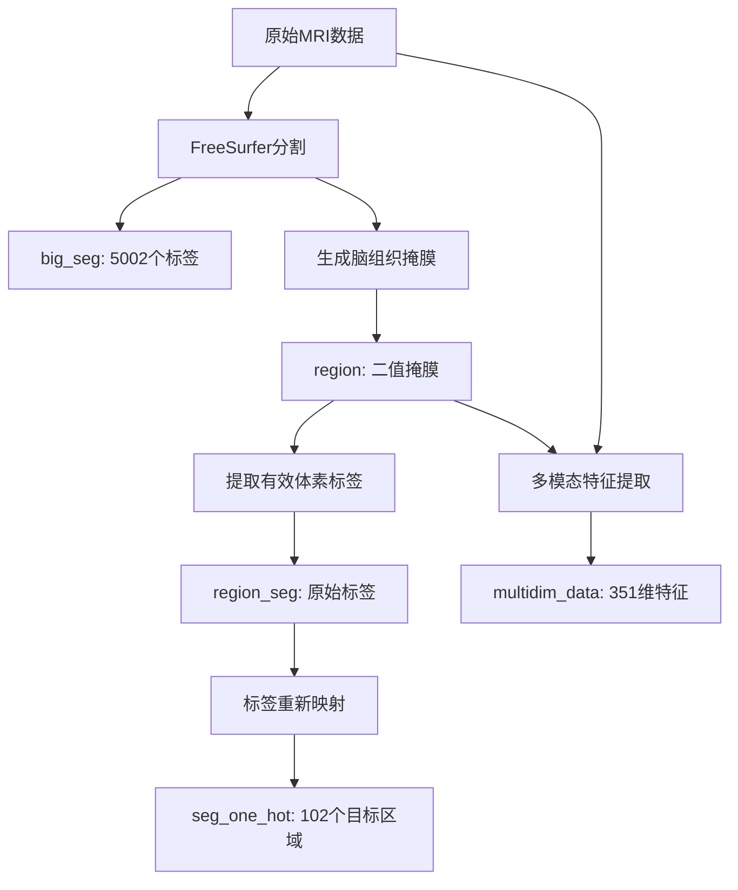

# MRI多模态脑区域分割数据集

## 数据集概述

本数据集包含38个被试的多模态MRI数据，用于深度学习驱动的脑区域分割任务。每个被试的数据已经过FreeSurfer分割、配准和特征提取处理，包含高维多模态特征和精确的解剖标签。

### 基本信息
- **被试数量**: 38个
- **文件格式**: MATLAB .mat文件 (HDF5格式)
- **平均文件大小**: 3.2GB
- **3D数据尺寸**: 384 × 336 × 256 体素
- **总体素数**: 33,030,144个
- **有效脑组织体素**: 约150万-240万个（因被试而异）

## 文件结构

每个MAT文件包含5个关键数据变量，详细描述如下：

### 1. `big_seg` - FreeSurfer完整分割结果

```
维度: (384, 336, 256)
数据类型: float64
数值范围: 0 - 5002
唯一值数量: ~194个
非零体素: ~3,800,000个
```

**描述**: 
FreeSurfer软件对整个脑体积进行解剖分割的完整结果，包含5002个不同的解剖标签，涵盖皮层、皮下结构、脑干、小脑等所有脑区域。

- `0`: 背景（非脑组织）
- `1-5002`: 不同的解剖结构（海马、杏仁核、各皮层区域等）

**用途**: 提供完整的解剖参考，用于理解脑结构的空间分布

### 2. `region` - 脑组织二值掩膜

```
维度: (384, 336, 256)
数据类型: uint8
数值范围: 0 - 1
唯一值数量: 2个
非零体素: ~2,000,000个
```

**描述**: 
定义有效脑组织区域的二值掩膜，决定哪些体素参与后续分析。

- `0`: 背景区域（颅骨外、脑脊液、非脑组织等）
- `1`: 有效脑组织区域（参与分析的体素）

**关键作用**: 建立3D坐标与1D数据间的映射关系，不同被试的有效体素数量反映个体脑体积差异

### 3. `multidim_data` - 多模态特征数据

```
维度: (351, n_voxels)
数据类型: float32
特征维度: 351维
体素数量: 因被试而异（~1,200,000 - 2,400,000）
```

**描述**: 
每个有效体素的351维多模态MRI特征向量，包含多种定量MRI参数。

**特征组成**:
T1加权成像数据
CEST (Chemical Exchange Saturation Transfer) M0参数
QSM (Quantitative Susceptibility Mapping) 数值
包括但不限于各种定量MRI指标

**数据特性**:
- 数据已标准化和质量控制
- 按Fortran顺序（列优先）展平，与MATLAB兼容
- 与其他1D数据的体素顺序严格对应

### 4. `region_seg` - 体素级FreeSurfer标签

```
维度: (1, n_voxels)
数据类型: float64
数值范围: 4 - 5002
唯一值数量: ~186个
```

**描述**: 
记录每个有效体素在FreeSurfer原始分割中的标签值，作为标签映射的中间步骤。

- 包含约186个不同的FreeSurfer标签（从5002个原始标签中筛选）
- 与`multidim_data`的体素顺序完全对应
- 保留每个体素的详细解剖信息

**映射关系**: 
```
region中每个=1的体素 → 按C-order(行优先)顺序提取对应的big_seg标签值 → 存储在region_seg中
```

**重要**: 映射使用numpy的C-order(行优先)顺序，不是MATLAB的Fortran顺序。

### 5. `seg_one_hot` - 102脑区域One-Hot编码

```
维度: (102, n_voxels)
数据类型: uint8
激活区域: ~100个（102个中的100个）
```

**描述**: 
将FreeSurfer原始标签重新映射并编码为102个预定义脑区域的one-hot表示。

- 每个体素用102维one-hot向量表示其所属区域
- 每个体素只属于一个区域（每列只有一个1）
- 102个区域是根据神经科学需求定义的感兴趣区域（ROI）
- 不是所有区域在每个被试中都存在

**用途**: 机器学习模型的目标标签，用于脑区域分类任务

## 数据处理流程



## 关键映射关系

### 3D到1D的映射机制

```python
# 示例：从3D数据提取1D特征（验证过的映射关系）
valid_mask = (region == 1)  # 找到有效体素位置
valid_coords = np.where(valid_mask)  # 使用C-order(行优先)顺序获取坐标

# 对每个有效体素（按C-order顺序）
for i, (x, y, z) in enumerate(zip(*valid_coords)):
    multidim_data[:, i] = extract_features_at(x, y, z)  # 提取351维特征
    region_seg[0, i] = big_seg[x, y, z]  # 记录原始标签（已验证100%匹配）
    seg_one_hot[:, i] = one_hot_encode(map_label(big_seg[x, y, z]))  # 映射到102类
```

### 标签映射流程

```
FreeSurfer标签(4-5002) → 标签映射表 → 目标区域(0-101) → One-hot编码(102维)
```

## 数据完整性验证

### 维度一致性检查
- `region`中非零体素数 = `multidim_data`的列数
- `multidim_data`列数 = `region_seg`列数 = `seg_one_hot`列数
- 所有1D数据的体素顺序严格对应

### 标签一致性检查
- `region_seg`中的标签值均来自`big_seg`中region=1位置
- `seg_one_hot`是`region_seg`经映射和one-hot编码的结果
- 每个体素在`seg_one_hot`中只有一个激活维度

## 数据加载和使用

### 推荐的Python加载方式

```python
import h5py
import numpy as np

def load_subject_data(filepath):
    """加载单个被试的数据"""
    with h5py.File(filepath, 'r') as f:
        # 加载所有数据
        big_seg = np.array(f['big_seg'])          # (384, 336, 256)
        region = np.array(f['region'])            # (384, 336, 256)
        multidim_data = np.array(f['multidim_data'])  # (351, n_voxels)
        region_seg = np.array(f['region_seg'])    # (1, n_voxels)
        seg_one_hot = np.array(f['seg_one_hot'])  # (102, n_voxels)
        
    return {
        'big_seg': big_seg,
        'region': region,
        'features': multidim_data.T,  # 转置为 (n_voxels, 351)
        'labels_raw': region_seg.flatten(),
        'labels_onehot': seg_one_hot.T  # 转置为 (n_voxels, 102)
    }

# 使用示例
data = load_subject_data('OHC_13_ckgulxe.mat')
print(f"特征形状: {data['features'].shape}")
print(f"标签形状: {data['labels_onehot'].shape}")
```

### 3D数据重构

```python
def revert_to_3d(features_1d, region_mask):
    """将1D特征数据映射回3D体积"""
    h, w, d = region_mask.shape
    n_voxels, n_features = features_1d.shape
    
    # 创建4D输出数组 (h, w, d, n_features)
    volume_4d = np.zeros((h, w, d, n_features), dtype=np.float32)
    
    # 找到有效体素位置
    valid_mask = region_mask > 0
    
    # 验证体素数量匹配
    assert np.sum(valid_mask) == n_voxels, "体素数量不匹配"
    
    # 将1D数据填回3D位置
    for i in range(n_features):
        temp_volume = np.zeros((h, w, d))
        temp_volume[valid_mask] = features_1d[:, i]
        volume_4d[:, :, :, i] = temp_volume
    
    return volume_4d
```

## 使用注意事项

### 内存管理
- 每个文件约3GB，建议逐个处理避免内存溢出
- 可考虑使用数据生成器进行批量加载

### 数据顺序
- **重要**: 3D到1D的映射使用**C-order(行优先)**顺序，不是Fortran顺序
- 所有1D数据（multidim_data, region_seg, seg_one_hot）的体素顺序严格对应
- 使用`np.where(region == 1)`默认提取顺序

### 标签处理
- 需要FreeSurfer到102类的标签映射表
- 不是所有102个类别在每个被试中都存在
- 建议在训练前检查类别分布

### 特征选择
- 原始351维特征可根据需求选择子集
- 建议参考TRAIN38.mat中使用的341维特征配置

## 与TRAIN38.mat的关系

本数据集与整合训练文件TRAIN38.mat的对应关系：

| 单独文件变量 | TRAIN38变量 | 变换说明 |
|-------------|-------------|----------|
| `multidim_data` | `data` | 351维→341维降维，38个文件合并 |
| `seg_one_hot` | `region` | 直接对应，38个文件合并 |
| - | `prob_idx` | 添加被试标识符(1-38) |
| - | `all_age` | 添加年龄信息 |


---

*最后更新: 2025年8月*