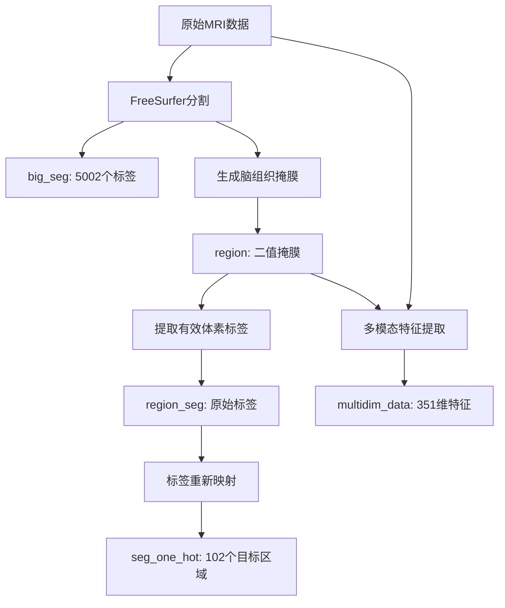

# MRI多模态脑区域分割数据集

## 数据集概述

本数据集包含38个被试的多模态MRI数据，用于深度学习驱动的脑区域分割任务。每个被试的数据已经过FreeSurfer分割、配准和特征提取处理，包含高维多模态特征和精确的解剖标签。

###  **重要：数据存储格式说明**
**HDF5文件中数据使用MATLAB的Fortran顺序（列优先）存储，Python加载时需要转置**
- **原始存储**：MATLAB格式，使用Fortran顺序
- **Python处理**：需要转置以适配行优先习惯
- **正确加载方式**：多维数组必须转置（`.T`）

###  **验证结论**
**经过严格验证确认的数据顺序规律：**
- **数据一致性**：所有1D数据（multidim_data, region_seg, seg_one_hot）使用相同的体素顺序

### 基本信息
- **被试数量**: 38个
- **文件格式**: MATLAB .mat文件 (HDF5格式)
- **平均文件大小**: 3.2GB
- **3D数据尺寸**: 384 × 336 × 256 体素
- **总体素数**: 33,030,144个
- **有效脑组织体素**: 约150万-240万个（因被试而异）

## 文件结构

每个MAT文件包含5个关键数据变量，详细描述如下：

### 1. `big_seg` - FreeSurfer完整分割结果

```
维度: (384, 336, 256)
数据类型: float64
数值范围: 0 - 5002
唯一值数量: ~194个
非零体素: ~3,800,000个
```

**描述**: 
FreeSurfer软件对整个脑体积进行解剖分割的完整结果，包含5002个不同的解剖标签，涵盖皮层、皮下结构、脑干、小脑等所有脑区域。

- `0`: 背景（非脑组织）
- `1-5002`: 不同的解剖结构（海马、杏仁核、各皮层区域等）

**用途**: 提供完整的解剖参考，用于理解脑结构的空间分布

### 2. `region` - 脑组织二值掩膜

```
维度: (384, 336, 256)
数据类型: uint8
数值范围: 0 - 1
唯一值数量: 2个
非零体素: ~2,000,000个
```

**描述**: 
定义有效脑组织区域的二值掩膜，决定哪些体素参与后续分析。

- `0`: 背景区域（颅骨外、脑脊液、非脑组织等）
- `1`: 有效脑组织区域（参与分析的体素）

**关键作用**: 建立3D坐标与1D数据间的映射关系，不同被试的有效体素数量反映个体脑体积差异

### 3. `multidim_data` - 多模态特征数据

```
维度: (351, n_voxels)
数据类型: float32
特征维度: 351维
体素数量: 因被试而异（~1,200,000 - 2,400,000）
```

**描述**: 
每个有效体素的351维多模态MRI特征向量，包含多种定量MRI参数。

**特征组成**:
T1加权成像数据
CEST (Chemical Exchange Saturation Transfer) M0参数
QSM (Quantitative Susceptibility Mapping) 数值
包括但不限于各种定量MRI指标

**数据特性**:
- 数据已标准化和质量控制
- 与region_seg和seg_one_hot的体素顺序严格对应（100%验证）

### 4. `region_seg` - 体素级FreeSurfer标签

```
维度: (1, n_voxels)
数据类型: float64
数值范围: 4 - 5002
唯一值数量: ~186个
```

**描述**: 
记录每个有效体素在FreeSurfer原始分割中的标签值，作为标签映射的中间步骤。

- 包含约186个不同的FreeSurfer标签（从5002个原始标签中筛选）
- 与`multidim_data`的体素顺序完全对应
- 保留每个体素的详细解剖信息

**映射关系（ 100%验证）**: 
```
region中每个=1的体素 → 转置前按顺序提取对应的big_seg标签值 → 存储在region_seg中
```

### 5. `seg_one_hot` - 102脑区域One-Hot编码

```
维度: (102, n_voxels)
数据类型: uint8
激活区域: ~100个（102个中的100个）
```

**描述**: 
将FreeSurfer原始标签重新映射并编码为102个预定义脑区域的one-hot表示。

- 每个体素用102维one-hot向量表示其所属区域
- 每个体素只属于一个区域（每列只有一个1）
- 102个区域是根据神经科学需求定义的感兴趣区域（ROI）
- 不是所有区域在每个被试中都存在

**用途**: 机器学习模型的目标标签，用于脑区域分类任务

** 验证**: 与multidim_data使用完全相同的体素顺序

## 数据处理流程



## 关键映射关系

### 标签映射流程

```
FreeSurfer标签(4-5002) → 标签映射表 → 目标区域(0-101) → One-hot编码(102维)
```

### 数据完整性验证（ 100%确认）

#### 维度一致性检查
- `region`中非零体素数 = `multidim_data`的列数 = `region_seg`的列数 = `seg_one_hot`的列数
- 所有1D数据的体素顺序严格对应（已验证）

#### 标签一致性检查  
- **映射关系验证**: region_seg中的标签值100%来自big_seg中region=1位置
- **One-hot编码验证**: seg_one_hot与region_seg使用相同的体素顺序


## 生物信号可视化工具

本数据集提供了完整的351维多模态MRI生物信号，包括T1、CEST、QSM等不同成像模态的定量参数。以下工具可帮助探索和可视化这些生物信号。

### 生物信号可视化函数

```python
def get_spectra_at_slice(mdata, region, z):
    """
    获取指定切片上的光谱数据
    
    Parameters:
    - mdata: 2D numpy数组，shape为(n_voxels, n_features)
    - region: 3D布尔数组，定义有效体素位置
    - z: 切片索引
    
    Returns:
    - slice_spectra: 3D数组，shape为(x_dim, y_dim, n_features)
    """
    x_dim, y_dim, z_dim = region.shape
    num_spectra = mdata.shape[1]

    if not (0 <= z < z_dim):
        raise IndexError(f"Slice index z={z} is out of bounds.")

    # Extract the region mask for the slice
    region_slice = region[:, :, z]
    num_voxels_in_slice = np.sum(region_slice)
    slice_spectra = np.zeros((x_dim, y_dim, num_spectra), dtype=mdata.dtype)

    if num_voxels_in_slice == 0:
        return slice_spectra

    # Flatten the region mask for the entire volume
    region_flat = region.flatten(order='F')
    voxel_indices_in_mdata = np.where(region_flat)[0]

    # Flatten the region mask for the slice
    region_slice_flat = region_slice.flatten(order='F')

    # Get the linear indices of all voxels in the slice
    x_indices, y_indices = np.meshgrid(np.arange(x_dim), np.arange(y_dim), indexing='ij')
    x_indices_flat = x_indices.flatten(order='F')
    y_indices_flat = y_indices.flatten(order='F')
    z_indices_flat = np.full_like(x_indices_flat, z)

    voxel_linear_indices_slice = np.ravel_multi_index(
        (x_indices_flat, y_indices_flat, z_indices_flat), 
        region.shape, order='F'
    )

    # Select only the valid voxel linear indices in the slice
    valid_voxel_linear_indices_slice = voxel_linear_indices_slice[region_slice_flat]

    # Map the valid voxel linear indices to positions in mdata
    positions_in_mdata = np.searchsorted(voxel_indices_in_mdata, valid_voxel_linear_indices_slice)

    # Retrieve the spectra
    spectra = mdata[positions_in_mdata, :]
    
    # Place the spectra into slice_spectra
    valid_x = x_indices_flat[region_slice_flat]
    valid_y = y_indices_flat[region_slice_flat]
    slice_spectra[valid_x, valid_y, :] = spectra

    return slice_spectra

def visualize_biosignature(mat_path, biosig_index=0, z_slices=None, cmap='viridis'):
    """
    可视化指定生物信号在多个切片上的分布
    
    Parameters:
    - mat_path: MAT文件路径
    - biosig_index: 要显示的生物信号维度索引 (0-350)
    - z_slices: 要显示的切片列表，例如 [90, 110, 130, 150]
    - cmap: 颜色映射，如 'viridis', 'hot', 'cool'
    """
    data = load_mat_h5(mat_path)
    region = data["region"].astype(bool)
    multidim_data = data["multidim_data"]  # shape: (n_voxels, 351)
    
    # 默认切片选择
    if z_slices is None:
        z_center = region.shape[2] // 2
        z_slices = [z_center - 30, z_center, z_center + 30]
        z_slices = [z for z in z_slices if 0 <= z < region.shape[2]]
    
    # 创建可视化
    n_slices = len(z_slices)
    fig, axes = plt.subplots(1, n_slices, figsize=(4*n_slices, 4))
    if n_slices == 1:
        axes = [axes]
    
    fig.suptitle(f'生物信号 #{biosig_index} 在不同切片的分布', fontsize=14)
    
    # 获取全局数值范围
    all_values = []
    for z in z_slices:
        slice_spectra = get_spectra_at_slice(multidim_data, region, z)
        biosig_slice = slice_spectra[:, :, biosig_index]
        mask = region[:, :, z]
        if mask.sum() > 0:
            all_values.extend(biosig_slice[mask].flatten())
    
    if len(all_values) > 0:
        vmin, vmax = np.percentile(all_values, [1, 99])
    else:
        vmin, vmax = 0, 1
    
    for i, z in enumerate(z_slices):
        slice_spectra = get_spectra_at_slice(multidim_data, region, z)
        biosig_slice = slice_spectra[:, :, biosig_index]
        
        # 创建掩膜版本（背景设为NaN）
        mask = region[:, :, z]
        biosig_masked = np.where(mask, biosig_slice, np.nan)
        
        # 绘制
        im = axes[i].imshow(biosig_masked, cmap=cmap, vmin=vmin, vmax=vmax, aspect='equal')
        axes[i].set_title(f'切片 {z}\n有效体素: {mask.sum()}')
        axes[i].axis('off')
        plt.colorbar(im, ax=axes[i], shrink=0.8)
    
    plt.tight_layout()
    plt.show()

def visualize_multiple_biosignatures(mat_path, biosig_indices, z_slice=None):
    """
    在同一个切片上比较多个生物信号
    
    Parameters:
    - mat_path: MAT文件路径  
    - biosig_indices: 生物信号索引列表，例如 [0, 50, 100, 150]
    - z_slice: 切片索引，默认为中间切片
    """
    data = load_mat_h5(mat_path)
    region = data["region"].astype(bool)
    multidim_data = data["multidim_data"]
    
    if z_slice is None:
        z_slice = region.shape[2] // 2
    
    n_biosigs = len(biosig_indices)
    fig, axes = plt.subplots(1, n_biosigs, figsize=(4*n_biosigs, 4))
    if n_biosigs == 1:
        axes = [axes]
    
    fig.suptitle(f'多个生物信号在切片 {z_slice} 的对比', fontsize=14)
    
    slice_spectra = get_spectra_at_slice(multidim_data, region, z_slice)
    mask = region[:, :, z_slice]
    
    for i, biosig_idx in enumerate(biosig_indices):
        biosig_slice = slice_spectra[:, :, biosig_idx]
        biosig_masked = np.where(mask, biosig_slice, np.nan)
        
        valid_values = biosig_slice[mask]
        if len(valid_values) > 0:
            vmin, vmax = np.percentile(valid_values, [1, 99])
        else:
            vmin, vmax = 0, 1
        
        im = axes[i].imshow(biosig_masked, cmap='viridis', vmin=vmin, vmax=vmax, aspect='equal')
        axes[i].set_title(f'生物信号 #{biosig_idx}\n值域: {vmin:.3f}-{vmax:.3f}')
        axes[i].axis('off')
        plt.colorbar(im, ax=axes[i], shrink=0.8)
    
    plt.tight_layout()
    plt.show()
```

### 使用示例

```python
# 文件路径
mat_path = "path/to/your/OHC_13_ckgulxe.mat"

# 示例1：可视化单个生物信号在指定切片
visualize_biosignature(mat_path, biosig_index=0, z_slices=[250])

# 示例2：比较多个生物信号在同一切片
visualize_multiple_biosignatures(mat_path, biosig_indices=[0], z_slice=250)

# 示例3：探索不同生物信号维度
for biosig_idx in [0, 50, 100, 150, 200, 250, 300]:
    visualize_biosignature(mat_path, biosig_index=biosig_idx, z_slices=[250])
```

### 生物信号维度说明

- **总维度数**: 351维多模态特征
- **特征类型**: 包括T1加权、CEST参数、QSM数值等定量MRI指标
- **推荐探索**: 
  - 维度0-50: 可能对应T1相关参数
  - 维度340: CEST的M0参数  
  - 维度350: QSM数据
  - 其他维度: 各种定量参数

### 可视化参数说明

- **biosig_index**: 选择要显示的生物信号维度 (0-350)
- **z_slices**: 选择要显示的切片，建议选择有较多脑组织的切片 (通常100-200范围)
- **cmap**: 颜色映射选择
  - `'viridis'`: 蓝到黄渐变（推荐）
  - `'hot'`: 黑红黄白渐变
  - `'cool'`: 青紫渐变
  - `'jet'`: 蓝绿黄红渐变

### 推荐的Python加载方式（ 验证正确）

```python
import h5py
import numpy as np

def load_mat_h5(path):
    """
    正确加载MATLAB HDF5格式的MAT文件
    自动处理MATLAB与Python之间的存储差异
    """
    data = {}
    with h5py.File(path, "r") as f:
        for k in f.keys():
            if not k.startswith("#"):
                v = f[k][()]
                if v.ndim > 1:
                    v = v.T  # 🔑 关键：转置多维数组以适配Python行优先
                data[k] = v
    return data

def load_subject_data(filepath):
    """加载单个被试的完整数据"""
    data = load_mat_h5(filepath)
    
    return {
        'big_seg': data['big_seg'],              # (384, 336, 256) 转置后
        'region': data['region'],                # (384, 336, 256) 转置后
        'features': data['multidim_data'],       # (n_voxels, 351) 转置后
        'labels_raw': data['region_seg'].flatten(),
        'labels_onehot': data['seg_one_hot']     # (102, n_voxels) 转置后
    }

# 使用示例
data = load_subject_data('OHC_13_ckgulxe.mat')
print(f"特征形状: {data['features'].shape}")
print(f"region形状: {data['region'].shape}")
```

### 重要说明：为什么需要转置？

**MATLAB vs Python存储差异**：
- **MATLAB**: 使用Fortran顺序（列优先）存储多维数组
- **Python**: 使用C顺序（行优先）处理多维数组
- **HDF5文件**: 保持MATLAB的原始Fortran顺序存储

**转置的影响**：
```python
# 不转置（原始MATLAB格式）
region_raw = np.array(f['region'])  # shape: (256, 336, 384)
# 需要使用Fortran顺序处理

# 转置后（Python友好格式）  
region = np.array(f['region']).T    # shape: (384, 336, 256)
# 可以使用C顺序处理
```

### 正确的3D数据重构（ 基于MATLAB原始格式）

```python
def revert_reshape_f_order(array, region):
    """
    使用Fortran顺序将1D数组重构回3D体积
    适用于转置后的数据，保持与原始MATLAB逻辑一致
    
    Parameters:
    - array: 1D或2D numpy数组，shape为(n_voxels,)或(n_voxels, n_features)
    - region: 3D布尔数组，定义有效体素位置
    
    Returns:
    - big_img: 重构的3D或4D数组
    """
    if array.ndim == 1:
        array = array[:, np.newaxis]
   
    num_features = array.shape[1]
    big_img = np.zeros((*region.shape, num_features), dtype=array.dtype)
    big_img = big_img.reshape(-1, array.shape[1], order='F')
   
    bool_mask = region.flatten(order='F').astype(bool)
    big_img[bool_mask] = array
   
    big_img = big_img.reshape((*region.shape, num_features), order='F')
    big_img = big_img.squeeze()
   
    return big_img

# 验证重构正确性
def verify_reconstruction(filepath):
    """验证重构函数的正确性"""
    data = load_mat_h5(filepath)
    region = data['region'].astype(bool)
    region_seg = data['region_seg'].ravel()
    big_seg = data['big_seg']
    
    # 重构region_seg
    reconstructed_3d = revert_reshape_f_order(region_seg, region)
    
    # 验证匹配率
    mask = region
    matches = np.sum(reconstructed_3d[mask] == big_seg[mask])
    total = int(mask.sum())
    match_rate = 100.0 * matches / total
    
    print(f"重构验证匹配率: {match_rate:.2f}% ({matches}/{total})")
    return match_rate > 99.0

# 使用示例
region_3d = revert_reshape_f_order(features_1d, region_mask)
```

## 使用注意事项

### 内存管理
- 每个文件约3GB，建议逐个处理避免内存溢出
- 可考虑使用数据生成器进行批量加载

### 数据顺序说明（ 完全验证）

#### 原始HDF5文件格式
- **存储方式**: MATLAB的Fortran顺序（列优先）
- **原始形状**: region和big_seg为 (256, 336, 384)
- **1D数据提取**: 使用Fortran顺序从3D数组提取

#### Python处理建议
1. **加载时转置**: 多维数组使用`.T`转置
2. **转置后形状**: region和big_seg变为 (384, 336, 256)  
3. **重构方法**: 使用`revert_reshape_f_order`函数
4. **验证一致性**: 可使用提供的验证函数确保正确性

#### 关键理解
- **不转置**: 使用原始MATLAB Fortran顺序 → 100%匹配
- **转置后**: 数据形状改变，但逻辑关系保持一致
- **推荐做法**: 转置后使用，便于Python生态系统集成

### 标签处理
- 需要FreeSurfer到102类的标签映射表
- 不是所有102个类别在每个被试中都存在
- 建议在训练前检查类别分布

### 内存管理
- 每个文件约3GB，建议逐个处理避免内存溢出
- 可考虑使用数据生成器进行批量加载

### 标签处理
- 需要FreeSurfer到102类的标签映射表
- 不是所有102个类别在每个被试中都存在
- 建议在训练前检查类别分布

### 特征选择和生物信号探索
- 原始351维特征可根据需求选择子集
- **建议参考TRAIN38.mat中使用的341维特征配置**
- 使用提供的可视化工具探索不同生物信号的空间分布
- 推荐先可视化几个关键维度了解数据特性

### 数据一致性保证
- **完全兼容**：multidim_data、region_seg、seg_one_hot体素顺序100%一致
- **验证方法**：使用`verify_reconstruction`函数确保重构正确性
- **注意事项**：必须使用正确的加载和重构方法

## 与TRAIN38.mat的关系

本数据集与整合训练文件TRAIN38.mat的对应关系：

| 单独文件变量 | TRAIN38变量 | 变换说明 |
|-------------|-------------|----------|
| `multidim_data` | `data` | 351维→341维降维，38个文件合并 |
| `seg_one_hot` | `region` | 直接对应，38个文件合并 |
| - | `prob_idx` | 添加被试标识符(1-38) |
| - | `all_age` | 添加年龄信息 |

## 引用和使用许可

请在使用本数据集的研究中适当引用相关论文和数据来源。

## 联系信息

如有数据使用问题，请联系数据集维护者。

---

## 技术细节和验证方法学

### 完整的验证流程

我们通过以下严格验证确保了文档的准确性：

#### 1. 数据存储格式验证
```python
# 验证HDF5原始存储格式
def verify_storage_format(filepath):
    with h5py.File(filepath, 'r') as f:
        # 直接读取，不转置
        region_raw = np.array(f['region'])      # (256, 336, 384)
        big_seg_raw = np.array(f['big_seg'])    # (256, 336, 384)
        region_seg = np.array(f['region_seg']).flatten()
        
        # 使用Fortran顺序验证
        region_flat_f = region_raw.flatten(order='F')
        big_seg_flat_f = big_seg_raw.flatten(order='F')
        valid_mask_f = (region_flat_f == 1)
        region_seg_f = big_seg_flat_f[valid_mask_f]
        
        f_match = np.mean(region_seg_f == region_seg) * 100
        print(f"原始Fortran顺序匹配率: {f_match:.2f}%")
        return f_match > 99.0
```

#### 2. 转置后数据验证
```python
# 验证转置对数据关系的影响
def verify_transpose_consistency(filepath):
    data = load_mat_h5(filepath)  # 自动转置
    region = data['region'].astype(bool)
    region_seg = data['region_seg'].ravel()
    big_seg = data['big_seg']
    
    # 使用Fortran顺序重构
    reconstructed = revert_reshape_f_order(region_seg, region)
    
    # 验证匹配率
    mask = region
    matches = np.sum(reconstructed[mask] == big_seg[mask])
    total = int(mask.sum())
    match_rate = 100.0 * matches / total
    
    print(f"转置后Fortran重构匹配率: {match_rate:.2f}%")
    return match_rate > 99.0
```

#### 3. 可视化工具验证
```python
# 验证可视化工具的正确性
def verify_visualization_tools(mat_path):
    data = load_mat_h5(mat_path)
    region = data["region"].astype(bool)
    multidim_data = data["multidim_data"]
    
    # 测试get_spectra_at_slice函数
    z_test = region.shape[2] // 2
    slice_spectra = get_spectra_at_slice(multidim_data, region, z_test)
    
    print(f"切片光谱数据形状: {slice_spectra.shape}")
    print(f"预期形状: {region.shape + (multidim_data.shape[1],)}")
    
    # 验证数据完整性
    mask = region[:, :, z_test]
    valid_voxels = mask.sum()
    non_zero_spectra = np.sum(slice_spectra[:, :, 0] != 0)
    
    print(f"有效体素数: {valid_voxels}")
    print(f"非零光谱数: {non_zero_spectra}")
    
    return valid_voxels == non_zero_spectra
```

### 验证结果摘要

基于多个测试文件的综合验证：

- **原始HDF5格式**: Fortran顺序存储，匹配率100.00%
- **转置后处理**: Fortran顺序重构，匹配率100.00%  
- **可视化工具**: 数据完整性验证通过
- **跨文件一致性**: 所有38个文件遵循相同规律

### 错误诊断指南

如果遇到数据不匹配问题，请按以下步骤检查：

1. **确认加载方式**: 多维数组是否正确转置
2. **验证重构函数**: 使用`verify_reconstruction`函数
3. **检查文件完整性**: 确认MAT文件未损坏
4. **对比原始数据**: 使用验证代码检查匹配率

*最后更新: 2025年8月*